# 🌤️ AtmosScale (Sistema de Tweets del Clima)

> **Arquitectura distribuida y escalable para procesamiento de datos meteorológicos en tiempo real**

[](https://www.rust-lang.org/)
[](https://go.dev/)
[](https://k3d.io/)
[](https://grpc.io/)
[](LICENSE)

## Descripción

**Sistema de Tweets del Clima** es una solución de arquitectura distribuida diseñada para simular la recepción y procesamiento masivo de datos climáticos provenientes de una red de sensores IoT distribuidos a nivel nacional.

### Caso a resolver 

> El **Instituto Nacional de Meteorología** necesita procesar lecturas de temperatura, humedad y estado del clima en tiempo real. Durante eventos extremos (tormentas, frentes fríos), los sensores aumentan su frecuencia de transmisión, generando picos de tráfico que un sistema monolítico tradicional no puede soportar.

#### Problemas que resuelve:

| Problema | Solución Implementada |
|----------|---------------------|
| Pérdida de datos críticos por saturación | Message Brokers (Kafka/RabbitMQ) como buffer de amortiguación |
| Caída del sistema por sobrecarga en escritura | Procesamiento asíncrono: recepción ≠ persistencia |
| Latencia alta en visualización de datos | Valkey (in-memory) + Grafana para sub-milisegundos de latencia |
| Recuperación manual tras fallos | Kubernetes con auto-healing y reinicio automático de pods |

---

## Arquitectura

```mermaid
graph LR
    A[Sensores IoT / Locust] -->|HTTP/JSON| B[API Rust Actix-Web]
    B -->|gRPC| C[Router Go Fiber]
    C -->|gRPC concurrente| D[Writer Kafka]
    C -->|gRPC concurrente| E[Writer RabbitMQ]
    D -->|Publish| F[Kafka Cluster KRaft]
    E -->|Publish| G[RabbitMQ]
    F -->|Consume| H[Kafka Consumer Go]
    G -->|Consume| I[RabbitMQ Consumer Go]
    H -->|XADD Stream| J[(Valkey)]
    I -->|XADD Stream| J
    J -->|Lectura| K[Grafana Dashboard]
    
    style B fill:#dea584,stroke:#333
    style C fill:#00ADD8,stroke:#333
    style D fill:#00ADD8,stroke:#333
    style E fill:#00ADD8,stroke:#333
    style F fill:#E53935,stroke:#333
    style G fill:#FF6600,stroke:#333
    style H fill:#00ADD8,stroke:#333
    style I fill:#00ADD8,stroke:#333
    style J fill:#C43E3C,stroke:#333
    style K fill:#F46800,stroke:#333
```



### Flujo de Datos End-to-End:

1. **Ingesta**: Sensores envían JSON vía HTTP POST a `/tweet`
2. **Traducción**: API Rust transforma JSON → Protobuf
3. **Distribución**: Router Go dispara llamadas gRPC concurrentes a ambos writers
4. **Encolamiento**: Writers publican en Kafka y RabbitMQ (patrón dual para resiliencia)
5. **Consumo**: Consumers leen de las colas y persisten en Valkey Streams
6. **Visualización**: Grafana consulta Valkey con `XREVRANGE` para dashboards en tiempo real

---

## Características

### Escalabilidad y Rendimiento
- API de entrada en **Rust/Actix-Web** optimizada para alta concurrencia
- Comunicación interna vía **gRPC** con serialización Protobuf eficiente
- Patrón **Fan-out** en el router para distribución paralela

### Resiliencia y Tolerancia a Fallos
- **Doble vía de mensajería**: Kafka + RabbitMQ para redundancia
- **Buffering asíncrono**: Los datos no se pierden si el almacenamiento falla
- **Auto-healing**: Kubernetes reinicia automáticamente pods fallidos

### Observabilidad
- **Grafana** integrado con datasource Valkey para métricas en tiempo real
- Logs estructurados por microservicio con `kubectl logs -l app=<service>`
- Health checks y readiness probes en todos los deployments

### Developer Experience
- **k3d** para clústeres Kubernetes locales multiplataforma (Windows/macOS/Linux)
- Zot Registry OCI privado para gestión de imágenes
- Scripts de inicialización y troubleshooting documentados

---

## Stack Tecnológico

| Capa | Tecnología | Propósito |
|------|-----------|-----------|
| **Lenguajes** | Rust 1.70+, Go 1.21+, Python 3.11 | Desarrollo de microservicios y testing |
| **API Framework** | Actix-Web (Rust), Fiber (Go) | Servidores HTTP de alta performance |
| **Comunicación** | gRPC + Protocol Buffers | Contratos estrictos entre servicios |
| **Message Brokers** | Apache Kafka (KRaft), RabbitMQ | Encolamiento asíncrono y redundancia |
| **Almacenamiento** | Valkey (Redis-compatible) | Persistencia en memoria de ultra baja latencia |
| **Orquestación** | Kubernetes (k3d/k3s) | Despliegue, escalado y auto-recuperación |
| **Registry** | Zot (OCI) | Repositorio privado de imágenes Docker |
| **Ingress** | NGINX Ingress Controller | Enrutamiento externo y TLS termination |
| **Monitoreo** | Grafana | Visualización de métricas y streams |
| **Testing** | Locust | Pruebas de carga y estrés distribuido |
| **Docs** | MkDocs + Material | Documentación técnica estática |

---

##  Estructura del Proyecto

```
AtmosScale/
├── 📄 README.md                 # Este archivo
├── 📄 Enunciado-referencia.pdf  # Especificaciones del caso de estudio
├── 📄 mkdocs.yml                # Configuración de documentación MkDocs
│
├── 📁 proto/                    # 📜 Contratos gRPC (fuente de verdad)
│   ├── tweet.proto              # Definición de mensajes y servicios
│   ├── tweet.pb.go              # Código generado para Go
│   ├── tweet_grpc.pb.go         # Stubs gRPC para Go
│   └── go.mod                   # Módulo Go para el paquete proto
│
├── 📁 api-rust/                 # 🦀 API REST de entrada (Actix-Web)
│   ├── Cargo.toml
│   ├── src/main.rs
│   └── Dockerfile
│
├── 📁 go-router/                # 🔄 Router gRPC (Go + Fiber)
│   ├── main.go
│   └── Dockerfile
│
├── 📁 go-writers/               # ✍️ Writers para brokers
│   ├── go-writer-kafka/
│   │   ├── main.go
│   │   └── Dockerfile
│   └── go-writer-rabbitmq/
│       ├── main.go
│       └── Dockerfile
│
├── 📁 go-consumers/             # 📥 Consumers para persistencia
│   ├── kafka-consumer/
│   │   ├── main.go
│   │   └── Dockerfile
│   └── rabbitmq-consumer/
│       ├── main.go
│       └── Dockerfile
│
├── 📁 k8s/                      # ☸️ Manifiestos Kubernetes
│   ├── 00-namespace.yaml        # Namespace weather-system
│   ├── 01-valkey.yaml           # StatefulSet Valkey
│   ├── 02-rabbitmq.yaml         # Deployment RabbitMQ
│   ├── 03-kafka.yaml            # Kafka Cluster con Strimzi (KRaft)
│   ├── 04-go-router.yaml        # Deployment + Service router
│   ├── 05-go-writers.yaml       # Writers Kafka/RabbitMQ
│   ├── 06-go-consumers.yaml     # Consumers con resource limits
│   ├── 07-api-rust.yaml         # API Rust con HPA ready
│   ├── 08-ingress.yaml          # NGINX Ingress rules
│   └── 09-grafana.yaml          # Grafana con datasource preconfigurado
│
├── 📁 k8s-docker-images/        # 🐳 Configs para importación local de imágenes
├── 📁 k8s-zot/                  # 🗄️ Configuración de Zot Registry
│
├── 📁 locust-test/              # 🧪 Pruebas de carga
│   ├── locustfile.py            # Script de usuario Locust
│   └── requirements.txt
│
└── 📁 docs/                     # 📚 Documentación técnica MkDocs
```

---

## Contribuir
1. Fork el repositorio
2. Crea tu rama de feature: `git checkout -b feat/nueva-funcionalidad`
3. Commit a tus cambios: `git commit -m 'feat: descripción clara y concisa'`
4. Push a la rama: `git push origin feat/nueva-funcionalidad`
5. Abre un Pull Request

## Licencia
MIT License

Copyright (c) 2026 Daniel Gálvez

Permission is hereby granted, free of charge, to any person obtaining a copy
of this software and associated documentation files (the "Software"), to deal
in the Software without restriction, including without limitation the rights
to use, copy, modify, merge, publish, distribute, sublicense, and/or sell
copies of the Software, and to permit persons to whom the Software is
furnished to do so, subject to the following conditions:

The above copyright notice and this permission notice shall be included in all
copies or substantial portions of the Software.

THE SOFTWARE IS PROVIDED "AS IS", WITHOUT WARRANTY OF ANY KIND, EXPRESS OR
IMPLIED, INCLUDING BUT NOT LIMITED TO THE WARRANTIES OF MERCHANTABILITY,
FITNESS FOR A PARTICULAR PURPOSE AND NONINFRINGEMENT. IN NO EVENT SHALL THE
AUTHORS OR COPYRIGHT HOLDERS BE LIABLE FOR ANY CLAIM, DAMAGES OR OTHER
LIABILITY, WHETHER IN AN ACTION OF CONTRACT, TORT OR OTHERWISE, ARISING FROM,
OUT OF OR IN CONNECTION WITH THE SOFTWARE OR THE USE OR OTHER DEALINGS IN THE
SOFTWARE.
